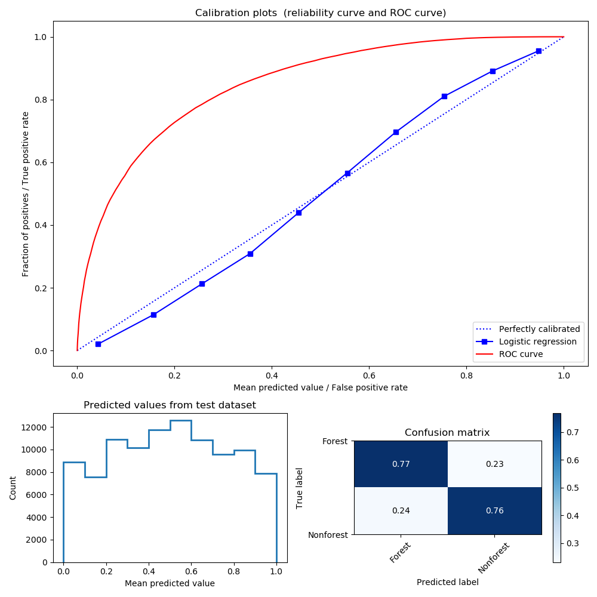

.. _worked_example_commandline:

Worked example on the command line
==================================

Here there will be an explain by example how the ``deforest`` processing chain works in practice. We will focus on an example from Manica and Manicaland provinces of Mozambique and Zimbabwe, with the aim of producing a remote sensing product for annual deforestation and near real-time warnings of tree cover change.

The study area for this example straddles the border of Mozambique and Zimbabwe, and is appropriate as it is relatively densely forested, with high rates of forest cover change. We'll use a dense time series of two Sentinel-2 tiles, **36KVD** and **36KWD**. This location has the CRS **UTM 36S** (EPSG: 32736), and an extent of **400,000 - 600,000** m Eastings, and **7,800,000 - 7,900,000** m Northings. This example will use all data from the start of the Sentinel-2 era to mid-July 2019, the time of writing.

Preparation
-----------

First insure that the :ref:`setup` instructions have been completed successfully.

Open a terminal, and use ``cd`` to navigate to the location you'd like to store data.

.. code-block:: console
    

    [user@linuxpc ~]$ mkdir worked_example
    [user@linuxpc ~]$ cd worked_example

Use mkdir to make a separate directory to contain the data you wish to download.

.. code-block:: console
    
    [user@linuxpc worked_example]$ mkdir DATA
    
To begin, navigate to the DATA folder.

.. code-block:: console
    
    [user@linuxpc worked_example]$ cd DATA

Data preparation
----------------

Downloading data
~~~~~~~~~~~~~~~~

The first step is to download Sentinel-2 level 1C data from the `Copernicus Open Access Data Hub <https://scihub.copernicus.eu/>`_.

For this we use the ``sen2mosaic`` ``download.py`` tool, installed as part of setup for ``deforest``. See `sen2mosaic documentation <https://sen2mosaic.rtfd.io>`_ for more details.

Here, the process will be to download all L2A data for the period 1st June 2018 to 2019 for the tile ``36KWD`` specifying a maximum cloud cover percetage of 30%:

.. code-block:: console
    
    [user@linuxpc DATA]$ s2m download -u user.name -p supersecret -t 36KWD -c 30 -s 20180601 -l 2A

.. note:: Not all Sentinel-2 data are available in L2A format, meaning that the user can either use L1C data, or preprocess data with sen2cor. See `sen2mosaic <https://www.bitbucket.org/sambowers/sen2mosaic>`_ for more details. 
 
``deforest`` works using long data time series, and will perform poorly where a time series is too short. Try to ensure access to at least 3 years worth of data. The remainder of this worked example will assume access to every L2A image from the start of the Sentinel-2 era to July 2019.

.. note:: Data from more than 1 year in the past may have been moved to the `Long Term Archive <https://earth.esa.int/web/sentinel/news/-/article/activation-of-long-term-archive-lta-access>`_. To access this data it's necessary to order it from Copernicus, which can be a laborious task. For most practical purposes, to use dense time series you should consider running these scripts on an online platform (e.g. F-TEP, DIAS, AWS) where data are stored locally to processing infrastructure.

Before contintuing, ensure that you have a directory (i.e. ``DATA``) containing a series of Sentinel-2 .SAFE files. In this case, there will be data for two Sentinel-2 tiles, ``36KVD`` and ``36KWD``:

.. code-block:: console

    [user@linuxpc DATA]$ ls
    S2B_MSIL2A_20170630T072949_N0205_R049_T36KWC_20170630T075509.SAFE
    S2B_MSIL2A_20170710T072619_N0205_R049_T36KWC_20170710T074330.SAFE
    S2B_MSIL2A_20170713T075209_N0205_R092_T36KVD_20170713T075751.SAFE
    S2B_MSIL2A_20170713T075209_N0205_R092_T36KWC_20170713T075751.SAFE
    S2B_MSIL2A_20170713T075209_N0205_R092_T36KWC_20170713T080544.SAFE
    S2B_MSIL2A_20170713T075209_N0205_R092_T36KWD_20170713T075751.SAFE
    S2B_MSIL2A_20170720T074239_N0205_R049_T36KWC_20170720T074942.SAFE
    S2B_MSIL2A_20170723T073609_N0205_R092_T36KVD_20170723T075425.SAFE
    ...
    S2B_MSIL2A_20190703T073619_N0212_R092_T36KWD_20190703T122423.SAFE
    S2B_MSIL2A_20190713T073619_N0213_R092_T36KWD_20190713T111309.SAFE
    S2B_MSIL2A_20190723T073619_N0213_R092_T36KWD_20190723T115930.SAFE

Training the classifier
-----------------------

Training of the classifier is performed in two steps: i) Extracting data from a series of training pixels of stable forest and nonforest, and ii) Calibrating a classifier to separate the spectral characteristics of forest from those of nonforest.

.. note:: Both extraction and calibration steps *may* be skipped for the case of tiles ``36KVD`` and ``36KWD``, as ``deforest`` is provided with a default classifier trained at this location. For all other locations, it's strongly recommended that these steps are followed.

Extracting training data
~~~~~~~~~~~~~~~~~~~~~~~~

The first step to using the ``deforest`` algorithm is to extract training data. This task is performed with the ``deforest extract.py`` tool.

There are two options for specification of locations to extract training data, either using a shapefile or a raster image. In each case we need to specify the attributes of a 'forest' and a 'nonforest' pixel, and these should be associated with locations of stable forest/nonforest that do not change class over the course of the training period.

For ease, here we'll use a pre-existing land cover map to train our classifier (download on registration `here <http://2016africalandcover20m.esrin.esa.int/>`_). This map covers Africa at 20 m resolution for the year 2016, and it will be assumed that these classes are accurate and do not change between 2016 - 2019. This map has numbered land cover classes with meaning:

+-----------------------------------------+-------+
| Land cover                              | Value |
+-----------------------------------------+-------+
| No data                                 | 0     |
+-----------------------------------------+-------+
| Tree cover areas                        | 1     |
+-----------------------------------------+-------+
| Shrubs cover areas                      | 2     |
+-----------------------------------------+-------+
| Grassland                               | 3     |
+-----------------------------------------+-------+
| Cropland                                | 4     |
+-----------------------------------------+-------+
| Vegetation aquatic or regularly flooded | 5     |
+-----------------------------------------+-------+
| Lichens Mosses / Sparse vegetation      | 6     |
+-----------------------------------------+-------+
| Bare areas                              | 7     |
+-----------------------------------------+-------+
| Built up areas                          | 8     |
+-----------------------------------------+-------+
| Snow and/or ice                         | 9     |
+-----------------------------------------+-------+
| Open water                              | 10    |
+-----------------------------------------+-------+

To apply this to data in the existing directory containing Sentinel-2 data, use the following command:

.. code-block:: console
    
    [user@linuxpc worked_example]$ deforest extract path/to/DATA/ -r 20 -e 32736 -te 399980 7790200 609780 7900000 -t path/to/ESACCI-LC-L4-LC10-Map-20m-P1Y-2016-v1.0.tif -f 1 -nf 2 3 4 5 6 7 8 10 -v

This translates to extracting features from a random subset of forest (``-f``) and nonforest (``-nf``) pixels from a geotiff image (``-t``) on in each image contained within ``path/to/DATA``, with a specified resolution (``-r``), extent (``-e``) and a coordinate reference system specified by the `EPSG code <https://spatialreference.org/ref/epsg/>`_ (``-e``). 
    
If computational resources are limited, input training data can be limited to fewer images:

.. code-block:: console
    
    [user@linuxpc worked_example]$ deforest extract path/to/DATA/ -r 20 -e 32736 -te 399980 7790200 609780 7900000 -t path/to/ESACCI-LC-L4-LC10-Map-20m-P1Y-2016-v1.0.tif -o ./ --max_images 100 -f 1 -nf 2 3 4 5 6 7 8 10 -v
    
And if more computational resources are available, this process can be sped up by increasing the number of processes to, for instance, to run 8 similtaneous processes:

.. code-block:: console
    
    [user@linuxpc worked_example]$ deforest extract path/to/DATA/ -r 20 -e 32736 -te 399980 7790200 609780 7900000 -t path/to/ESACCI-LC-L4-LC10-Map-20m-P1Y-2016-v1.0.tif -o ./ -f 1 -nf 2 3 4 5 6 7 8 10 -v -p 8

Be aware, the more processes used the more computational resources will be required.

The user also specify a larger number of pixels to extract from each image (default: 5000 per class) using the ``--max_pixels`` (``-mp``) option:

.. code-block:: console
    
    [user@linuxpc worked_example]$ deforest extract path/to/DATA/ -r 20 -e 32736 -te 399980 7790200 609780 7900000 -t path/to/ESACCI-LC-L4-LC10-Map-20m-P1Y-2016-v1.0.tif -f 1 -nf 2 3 4 5 6 7 8 10 -mp 10000 -v

The output of this command will be a ``.npz`` file, which contains the pixel values for each classification feature.

.. code-block:: console
    
    [user@linuxpc worked_example]$ ls
    S2_training_data.npz
    ...

Calibrating the classifier
~~~~~~~~~~~~~~~~~~~~~~~~~~

The next step is to use this training data to calibrate the classifier of forest cover. This is performed with the ``deforest`` ``train.py`` tool. This tool takes the feature values from ``extract.py`` to train a classifier of forest/nonforest based on those feature values.

To train the classifier, run the command:

.. code-block:: console
    
    [user@linuxpc worked_example]$ deforest train S2_training_data.npz

To increase the complexity of the classifier, a larger number of pixel values from be subsampled from the input data (default = 100,000 pixels). For example, to train the model based on 200,000 pixels:

.. code-block:: console
    
    [user@linuxpc worked_example]$ deforest train S2_training_data.npz -m 200000

Once complete there will be two new files:

.. code-block:: console

    [user@linuxpc worked_example]$ ls
    S2_model.pkl
    S2_quality_assessment.png
    ...

``S2_model.pkl`` is an object that defines the calibrated classifier, ``S2_quality_assessment.png`` can be used to assess the quality of the model:

This figure shows three plots to aid interpretation of model quality:

- **Calibration plots** The plot at the top shows a calibration curve in blue and a receiver operating characteristic (ROC) curve. The closer the calibration curve is to the 1:1 line, and the further to the upper left the ROC curve reaches, the higher the quality of the calibration.
- **Predicted values** The plot at the bottom-left shows the distribution of forest probability predictions (0 to 1) from a random sample of the training data. Where a classifier is highly confident in predicting forest cover there will be peaks close to 0 (non-forest) and 1 (forest), and where less certain (such as this case) the distrubution will be flatter. To be avoided are classifiers that rarely confidently predict forest or non-forest.
- **Confusion matrix** The plot at the bottom-right is a confusion matrix, where input data labels (forest / non-forest) are compared to classifier predictions (< 50% = non-forest, > 50% = forest). A good classifier will generally score highly in the top-left and bottom-right boxes (true postives/negatives) and low in the bottom-left and top-right boxes (false positives/negatives).

The user should explore calibrating the classifier with multiple options until classifier results are satisfactory. An advanced user may choose to alter the input features for the classifier through modification of the ``loadFeatures()`` function in ``deforest/classify.py``.  

Classifing the data
-------------------

First, the user should make a new directory to store classified images:

.. code-block:: console
    
    [user@linuxpc worked_example]$ mkdir classified_images

The user can then run the classification algorithm that was just calibrated to produce probability of forest for each image. This operates very similarly to ``training.py``, here using the same output extents:

.. code-block:: console
    
    [user@linuxpc worked_example]$ deforest classify path/to/DATA/ -m S2_model.pkl -r 20 -e 32736 -te 399980 7790200 609780 7900000 -o classified_images/

This translates to classifying images contained within ``path/to/DATA`` using a trained classifier (``-m``), with a specified output resolution (``-r``), extent (``-te``) and projection (``-e``), and outputing classified images to a directory (``-o``).

.. note:: If using the default model in place of a locally calibrated model, omit the ``-m S2_model.pkl`` option to use the default model.

If resources are available, classification can can be sped up by allocating additional processes:
    
.. code-block:: console
    
    [user@linuxpc worked_example]$ deforest classify path/to/DATA/ -m S2_model.pkl -r 20 -e 32736 -te 399980 7790200 609780 7900000 -o classified_images -p 8

If without access to preprocessed L2A Sentinel-2 images, L1C data can be input using the ``-l`` option:

.. code-block:: console
   
    [user@linuxpc worked_example]$ deforest classify path/to/DATA/ -m S2_model.pkl -r 20 -e 32736 -te 399980 7790200 609780 7900000 -o classified_images -l 1C

Once complete, images will be output to the ``classified_images`` directory:

.. code-block:: console

    [user@linuxpc classified_images]$ ls
    S2_S2_T36KVD_20151126_075714.tif  S2_S2_T36KWC_20171001_075742.tif
    S2_S2_T36KVD_20151206_075547.tif  S2_S2_T36KWC_20171006_075832.tif
    S2_S2_T36KVD_20151226_080933.tif  S2_S2_T36KWC_20171008_075024.tif
    S2_S2_T36KVD_20151229_082023.tif  S2_S2_T36KWC_20171016_075320.tif
    S2_S2_T36KVD_20160105_080719.tif  S2_S2_T36KWC_20171023_074855.tif
    S2_S2_T36KVD_20160108_082023.tif  S2_S2_T36KWC_20171026_080348.tif
    S2_S2_T36KVD_20160125_080606.tif  S2_S2_T36KWC_20171031_075502.tif
    S2_S2_T36KVD_20160204_080212.tif  S2_S2_T36KWC_20171107_075205.tif
    S2_S2_T36KVD_20160207_080537.tif  S2_S2_T36KWC_20171120_075322.tif
    ...                               ...
    S2_S2_T36KWC_20170926_075507.tif  S2_S2_T36KWD_20180906_075434.tif
    S2_S2_T36KWC_20170928_074401.tif

These images will each have pixels numbered 0 to 100%, representing the probability of forest at that time point. The nodata value is 255.

For instance, this image shows forest probability in the study region for two images (``36KVD``: 01/10/2016, ``36KWD``: 26/11/2015), with pixels shown in darker green indicating a higher probability of forest in that image.

.. image:: _static/forest_prob.png

Change detection
----------------

The final step is to combine these classified images into an estimate of forest cover and forest cover change. For use the ``change.py`` command line tool:

.. code-block:: console
    
    [user@linuxpc worked_example]$ deforest change classified_images/*.tif

This process will combine all the probability images in ``classified_images``, and identify changes in the time series.

Options are available to change the parameters of change detection. For example, to apply a stricter probability threshold detection of confirmed changes:

.. code-block:: console
    
    [user@linuxpc worked_example]$ deforest change -t 0.9995 classified_images/*.tif

Or to alter block-weighting, which reduces the impact of very high or low probability outliers:

.. code-block:: console
    
    [user@linuxpc worked_example]$ deforest change -b 0.2 classified_images/*.tif

The ``change.py`` script will output two images:

.. code-block:: console
    
    [user@linuxpc worked_example]$ ls
    ...
    S2_confirmed.tif
    S2_warning.tif

The image ``S2_confirmed.tif`` shows the year of changes that have been detected in the time series (in this case 2017-2019.5). Locations of remaining forest are numbered 0. Note that the changes in the first year or two will be mostly spurious, as the landscape is initially considered entirely forested. It is recommended that the user either discards the first 2-3 years of changes, or uses a high-quality forest baseline map to mask out locations that weren't forest at the start of the time series.

.. image:: _static/S2_confirmed.png

The image ``S2_warning.tif`` shows the combined probability of non-forest existing at the end of the time series in locations that have not yet been flagged as deforested. This can be used to provide information on locations that have not yet reached the threshold for confirmed changes, but are looking likely to possible. A simple probability threshold can be applied to supply early warnings.

.. image:: _static/S2_warning.png
